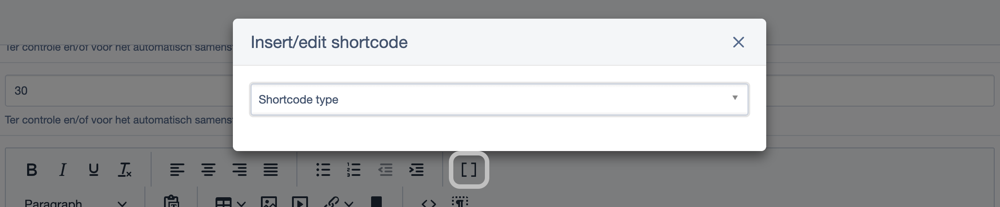

# Simpler Silverstripe

Makes SilverStripe Admin development simpler by re-introducing traditional basics.

## Features

| Feature | Size | Loaded | Notes |
|---------|------|--------|-------|
| **Static Session** - `Session::get()` instead of verbose alternative | - | Always | PHP only |
| **HeadRequirements** - Import maps and early scripts in `<head>` | - | Always | PHP + templates |
| **DOM Events** - `DOMNodesInserted`/`DOMNodesRemoved` for dynamic content | ~5kb | Always | Core bundle |
| **Vue 3 Import Map** - Use Vue in your own ES modules | ~162kb | Opt-in | AdminExtension |
| **Modal Dialog** - Bootstrap modal via `simpler.modal` | ~24kb | Opt-in | Requires import map |

**Total sizes:**
- DOM events only: ~5kb (always loaded)
- Import map with Vue only: ~5kb + 162kb = **~167kb** (for your own Vue components)
- Modal via PHP: ~5kb + 162kb + 24kb = **~191kb** (import map auto-injected)
- Modal via JS config: same, but requires AdminExtension in config

## 1. DOM events (always loaded)

Listen for dynamically inserted content (Ajax, React components):

**Note:** An `xhr_buffer` element (`<template id="xhr_buffer">`) is automatically created on page load. This hidden element is used to parse AJAX HTML through jQuery before inserting into Vue/DOM, which triggers Entwine-style listeners that don't fire when content is inserted directly by Vue.

```js
document.addEventListener("DOMNodesInserted", function(event) {
    console.log('Type:', event.detail.type); // LOAD, MUTATION, MOUNT, UNMOUNT
    console.log('Target:', event.target);

    // Initialize your plugins on new content
    initMyPlugin();
});

document.addEventListener("DOMNodesRemoved", function(event) {
    // Cleanup when content is removed
    destroyMyPlugin();
});
```

**Event types:**
- `LOAD` - Initial DOMContentLoaded
- `MUTATION` - MutationObserver detected DOM changes
- `MOUNT` - React Form component mounted (on specific element)
- `UNMOUNT` - React Form component will unmount

### jQuery `$` alias (opt-in)

This module does not set `window.$` by default (anymore, to avoid conflicts). If you want the `$` shorthand, either:

1. Add to your own JS file: `window.$ = window.$ || window.jQuery;`
2. Or use Requirements: `Requirements::customScript('window.$ = window.$ || window.jQuery;', 'jquery-alias');`

## 2. Vue 3 components (via import map, opt-in)

**IMPORTANT:** If using Vue components (SimplerModalField, EditProtectedTextField, or your own), you MUST add AdminExtension to LeftAndMain. Components will trigger a warning if the import map is not available on initial page load.

For using Vue 3 in your own code, add the extension:

```yaml
# app/_config/config.yml
SilverStripe\Admin\LeftAndMain:
  extensions:
    - Restruct\Silverstripe\Simpler\AdminExtension
```

This injects an import map that makes Vue available via `import { createApp } from 'vue'`. The extension automatically uses the dev build (with warnings/devtools) or prod build based on environment.

### Option A: Self-contained ES module file

Create a JS file (not webpack-bundled) and load it as a module:

```js
// mymodule/client/dist/js/my-vue-app.js
import { createApp, ref } from 'vue';

document.addEventListener('DOMContentLoaded', () => {
    createApp({
        setup() {
            const count = ref(0);
            return { count };
        },
        template: `<button @click="count++">Clicked {{ count }} times</button>`
    }).mount('#my-app');
});
```

Load via Requirements with `type="module"`:

```php
use SilverStripe\View\Requirements;

Requirements::javascript('mymodule/client/dist/js/my-vue-app.js', ['type' => 'module']);
```

### Option B: Inline in SilverStripe template

Mix SS template tags directly with Vue - ideal for injecting server data into Vue components:

```html
<%-- templates/Includes/MyWidget.ss --%>
<script type="module">
import { createApp } from 'vue'

createApp({
    data() {
        return {
            apiBase: $Ctrl.Link('api').JSON.RAW,
            items: $Items.JSON.RAW,
            currentItem: {
                id: $CurrentItem.ID.JSON,
                title: "$CurrentItem.Title.JS",
                isActive: $CurrentItem.IsActive.JSON.RAW,
            }
        }
    },
    methods: {
        async saveItem() {
            const response = await fetch(this.apiBase + '/save', {
                method: 'POST',
                headers: { 'Content-Type': 'application/json' },
                body: JSON.stringify(this.currentItem)
            });
            // handle response...
        }
    }
}).mount('#my-widget-$ID')
</script>

<div id="my-widget-$ID">

    <h3>{{ currentItem.title }}</h3>

    <ul>
        <li v-for="item in items" :key="item.ID">
            {{ item.Title }}
            <% if $ShowExtra %>
                <span class="extra">$ExtraInfo</span>
            <% end_if %>
        </li>
    </ul>

    <button @click="saveItem" class="btn btn-primary">
        {$T('Save')}
    </button>

</div>
```

**Key patterns:**
- Use `$Variable.JSON.RAW` for objects/arrays/booleans (raw JSON, no escaping)
- Use `"$Variable.JS"` for strings (JS-escaped, in quotes)
- Use `$ID` or `$HexID` to make element IDs unique when template is used multiple times
- Mix `<% if %>` SS conditionals with Vue `v-if` directives as needed
- Use `{$T('Label')}` or `$fieldLabel('Name')` for translated strings in HTML

> **Entwine compatibility note:** Vue components inside CMS forms can trigger Entwine's MutationObserver bug (`el.getAttribute is not a function`). See "Known Issues" section below for details and workarounds.

## 3. Modal dialog (Vue 3 + Bootstrap modal, opt-in)



> **Note:** The Vue import map is automatically injected when using SimplerModalField/Action PHP classes.  
> Manual setup only needed if using `simpler.modal` directly from JavaScript.

To use `simpler.modal` from your own JS, you need both the Vue import map and simpler-modal.js:

**Option A: Via PHP** (in your Controller or Extension):
```php
use Restruct\Silverstripe\Simpler\AdminExtension;

AdminExtension::requireImportMap();
AdminExtension::requireModal();
```

**Option B: Via YAML config** (always loaded in admin):
```yaml
# app/_config/config.yml
SilverStripe\Admin\LeftAndMain:
  extensions:
    - Restruct\Silverstripe\Simpler\AdminExtension
  simpler_include_modal: true
```

### Basic usage

```js
simpler.modal.title = 'My Dialog';
simpler.modal.bodyHtml = '<p>Hello world!</p>';
simpler.modal.show = true;
```

### All options

```js
simpler.modal.title = 'Confirm Action';
simpler.modal.bodyHtml = '<p>Are you sure?</p>';
simpler.modal.closeBtn = true;      // Show close button (default: false)
simpler.modal.closeTxt = 'Cancel';  // Close button text (default: "Close")
simpler.modal.saveBtn = true;       // Show primary button (default: false)
simpler.modal.saveTxt = 'Confirm';  // Primary button text (default: "Save")
simpler.modal.static = true;        // Prevent closing via backdrop/Escape (default: false)
simpler.modal.size = 'lg';          // 'sm', 'lg', 'xl' or custom like '800px', '90vw' (default: null)
simpler.modal.show = true;
```

### Loading content via AJAX

```js
simpler.modal.title = 'Loading...';
simpler.modal.bodyHtml = simpler.spinner;  // Built-in loading spinner
simpler.modal.show = true;

$.get('/my/ajax/endpoint', function(html) {
    simpler.modal.bodyHtml = html;
    simpler.modal.title = 'Content Loaded';
});
```

All properties reset to defaults when the modal gets closed.

## 4. PHP FormField classes (drop-in PureModal replacement)

`SimplerModalField` and `SimplerModalAction` extend `lekoala/silverstripe-pure-modal` classes but render via `simpler.modal` instead of the CSS checkbox mechanism.

> **Requires:** `lekoala/silverstripe-pure-modal`  
> 
> **PureModal must be manually installed to use these classes**  
> Install via: `composer require lekoala/silverstripe-pure-modal`  

### How it differs from PureModal

PureModal renders inside the CMS form (as FormField), which means forms in modal become nested forms (invalid HTML). PureModal elegantly works around this using iframes.

SimplerModal takes a different approach: the modal is appended to `document.body` (outside the CMS form hierarchy), so forms inside work correctly without needing an iframe. This allows SimplerModalAction to render actual SilverStripe forms that submit directly.

### Usage

```php
use Restruct\Silverstripe\Simpler\SimplerModalField;
use Restruct\Silverstripe\Simpler\SimplerModalAction;

// Iframe content (e.g., preview) with extra large modal
SimplerModalField::create('preview', 'Preview')
    ->setIframeSrc('/admin/preview/123')
    ->setIframeHeight('80vh')
    ->setModalSize('xl')  // 'sm', 'lg', 'xl' or custom like '800px', '90vw'
    ->setCloseBtn(false)  // Hide footer close button (default: true)
    ->setButtonIcon('eye')
    ->addExtraClass('btn-outline-info');

// HTML content with custom width
SimplerModalField::create('info', 'Info')
    ->setContent('<p>Some information here</p>')
    ->setModalSize('600px');

// Custom dialog title (different from button text)
SimplerModalField::create('details', 'Show Details')
    ->setDialogTitle('Item Details')
    ->setContent($myHtmlContent);

// CMS action with form fields (form submits directly - no iframe!)
SimplerModalAction::create('translate', 'Translate')
    ->setFieldList(FieldList::create([
        DropdownField::create('lang', 'Language', ['en' => 'English', 'nl' => 'Dutch']),
        TextareaField::create('notes', 'Notes'),
    ]))
    ->setDialogButtonTitle('Start Translation');
```

### How it works

The PHP classes render a button with a `data-simpler-modal` attribute containing JSON config:

```html
<button type="button" data-simpler-modal='{"title":"Preview","bodyHtml":"<iframe src=\"/admin/preview/123\"..."}'>
    Preview
</button>
```

A generic click handler in `simpler-modal.js` parses this config and opens the modal:

```js
document.addEventListener('click', (e) => {
    const btn = e.target.closest('[data-simpler-modal]');
    if (!btn) return;

    const config = JSON.parse(btn.dataset.simplerModal);
    Object.assign(simpler.modal, config);
    simpler.modal.show = true;
});
```

### Migration from PureModal

Simply change the imports - the API is compatible:

```php
// Change from:
use LeKoala\PureModal\PureModal;
use LeKoala\PureModal\PureModalAction;

// To:
use Restruct\Silverstripe\Simpler\SimplerModalField as PureModal;
use Restruct\Silverstripe\Simpler\SimplerModalAction as PureModalAction;
```

All existing code continues to work - same API, better rendering.

## 5. Static session helpers

```php
use Restruct\Silverstripe\Simpler\Session;

// Instead of: $this->getRequest()->getSession()->get('key')
$value = Session::get('key');
Session::set('key', 'value');
Session::clear('key');
Session::clearAll();
```

## 6. HeadRequirements (import maps, early scripts)

For scripts that must be in `<head>` (import maps, early config):

```php
use Restruct\Silverstripe\Simpler\HeadRequirements;

// Import map entries (browsers allow only ONE import map - these accumulate)
HeadRequirements::import_map('vue', 'restruct/silverstripe-simpler:client/dist/js/vue.esm-browser.js');
HeadRequirements::import_map('lodash', 'https://cdn.jsdelivr.net/npm/lodash-es@4/lodash.min.js');

// JavaScript file in <head>
HeadRequirements::javascript('mymodule:client/dist/js/early-script.js');
HeadRequirements::javascript('https://cdn.example.com/lib.js', ['defer' => true]);

// Inline script in <head>
HeadRequirements::custom_script('window.CONFIG = { debug: true }', 'my-config');
```

Also available as template globals: `$HeadReq_importMap()`, `$HeadReq_js()`, `$HeadReq_customScript()`.

## 7. Configuration summary

```yaml
# Default (auto-applied by module):
SilverStripe\Admin\LeftAndMain:
  extra_requirements_javascript:
    - 'restruct/silverstripe-simpler:client/dist/js/simpler-silverstripe.js'

# Option 1: Import Map + Modal (via AdminExtension with simpler_include_modal)
# Best for: Using both your own Vue components AND the modal via JS
SilverStripe\Admin\LeftAndMain:
  extensions:
    - Restruct\Silverstripe\Simpler\AdminExtension
  simpler_include_modal: true

# Option 2: Import Map only (via AdminExtension)
# Best for: Using Vue 3 in your own ES modules (no modal)
SilverStripe\Admin\LeftAndMain:
  extensions:
    - Restruct\Silverstripe\Simpler\AdminExtension

# Option 3: Modal only via PHP classes
# Just use SimplerModalField/SimplerModalAction - they auto-inject the import map

# Option 4: Modal via JS only (without PHP classes)
SilverStripe\Admin\LeftAndMain:
  extensions:
    - Restruct\Silverstripe\Simpler\AdminExtension
  extra_requirements_javascript:
    - 'restruct/silverstripe-simpler:client/dist/js/simpler-modal.js': { type: module }
```

## 8. Development

### Local git checkout

When developing this module locally (checked out as git repo instead of installed via composer), you need to add the autoload path to your project's `composer.json`:

```json
"autoload": {
    "psr-4": {
        "Restruct\\Silverstripe\\Simpler\\": "_git_simpler/src/"
    }
}
```

Then run `composer dump-autoload`. This is required because composer doesn't automatically discover classes in local module directories - it only knows about paths defined in its autoload config.

### Building assets

```bash
cd silverstripe-simpler
yarn install
yarn run dev        # Watch mode
yarn run production # Production build
```

## Known Issues

### Entwine + Vue Conflict

Vue components in CMS forms can trigger `TypeError: el.getAttribute is not a function` due to Entwine's MutationObserver not filtering non-Element nodes.

**Solution:** This module includes automatic error suppression in `simpler-silverstripe.js` that allows Vue to work in CMS forms.

See [docs/ENTWINE_VUE_CONFLICT.md](docs/ENTWINE_VUE_CONFLICT.md) for details, alternatives, and future investigation options.

## Version notes

- **Branch ss5**: SilverStripe 5 (Vue 3)
- **Tag 0.1.9**: SilverStripe 5 (Vue 2, legacy)
- **main**: SilverStripe 6
